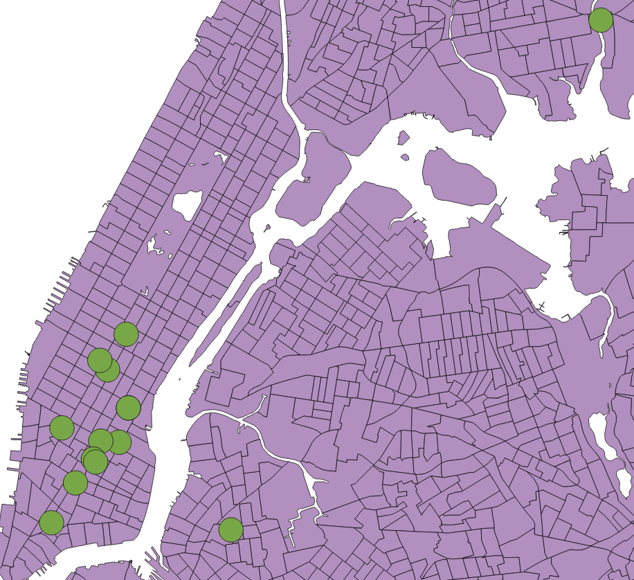

#Open Source Intersect - Shapely (and an OGR solution)

What I'd like to try and do is intersect these buffers with these census tracts, maintain their ID's and the tracts attributes. 

####These buffers are random points. The [Census Tracts are from NYC Department of City Planning](http://www.nyc.gov/html/dcp/html/bytes/districts_download_metadata.shtml#cbt)

##The following Code was able to do it. Thanks 
[GIS.StackExchange conversation](http://gis.stackexchange.com/questions/119374/intersect-shapefiles-using-shapely)

Thanks [ThomasG77](http://gis.stackexchange.com/users/638/thomasg77)

    import fiona
    from shapely.geometry import shape, mapping
    import rtree

    bufSHP = 'data/h1_buf.shp'
    intSHP = 'data/h1_buf_int_ct.shp'
    ctSHP  = 'data/nyct2010.shp'

    with fiona.open(bufSHP, 'r') as layer1:
        with fiona.open(ctSHP, 'r') as layer2:
            # We copy schema and add the  new property for the new resulting shp
            schema = layer2.schema.copy()
            schema['properties']['uid'] = 'int:10'
            # We open a first empty shp to write new content from both others shp
            with fiona.open(intSHP, 'w', 'ESRI Shapefile', schema) as layer3:
                index = rtree.index.Index()
                for feat1 in layer1:
                    fid = int(feat1['id'])
                    geom1 = shape(feat1['geometry'])
                    index.insert(fid, geom1.bounds)

                for feat2 in layer2:
                    geom2 = shape(feat2['geometry'])
                    for fid in list(index.intersection(geom2.bounds)):
                        if fid != int(feat2['id']):
                            feat1 = layer1[fid]
                            geom1 = shape(feat1['geometry'])
                            if geom1.intersects(geom2):
                                # We take attributes from ctSHP
                                props = feat2['properties']
                                # Then append the uid attribute we want from the other shp
                                props['uid'] = feat1['properties']['uid']
                                # Add the content to the right schema in the new shp
                                layer3.write({
                                    'properties': props,
                                    'geometry': mapping(geom1.intersection(geom2))
                                })
                                
                                
##Someoone also contributed some OGR code.
Thanks [mike-t](http://gis.stackexchange.com/users/1872/mike-t)

cd to the questions directory (not the data one)

	ogr2ogr -sql "SELECT ST_Intersection(A.geometry, B.geometry) AS geometry, A.*, B.* FROM nyct2010 A, h1_buf B WHERE ST_Intersects(A.geometry, B.geometry)" -dialect SQLITE data data -nln h1_buf_int_ct2